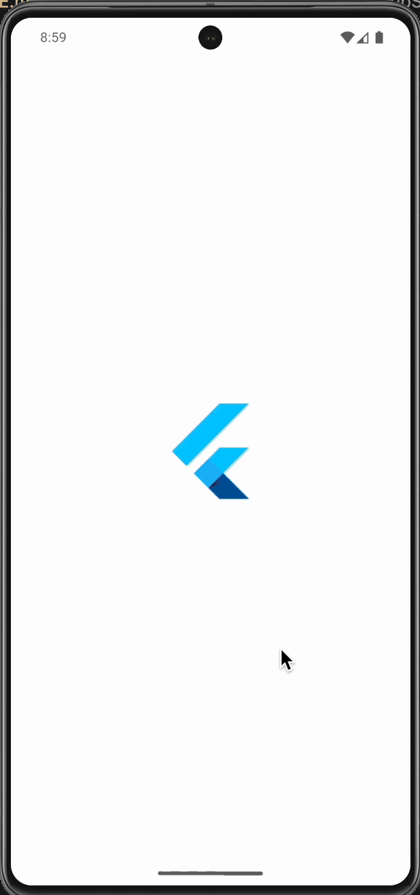
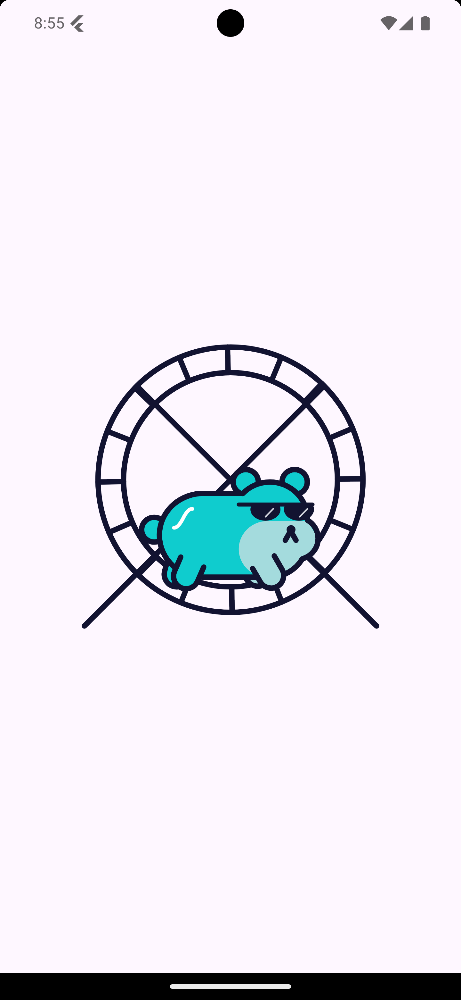
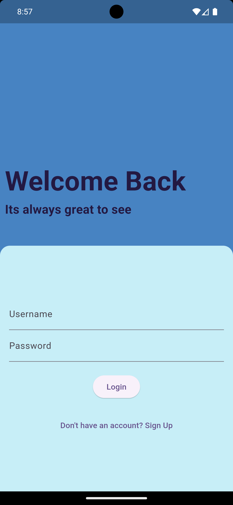
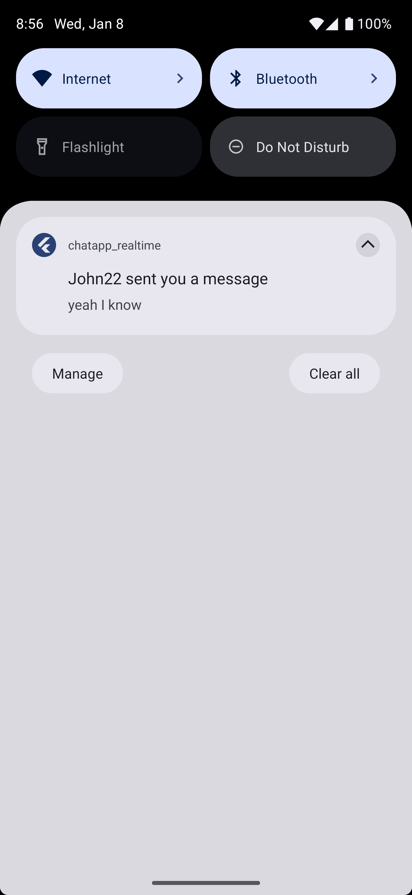
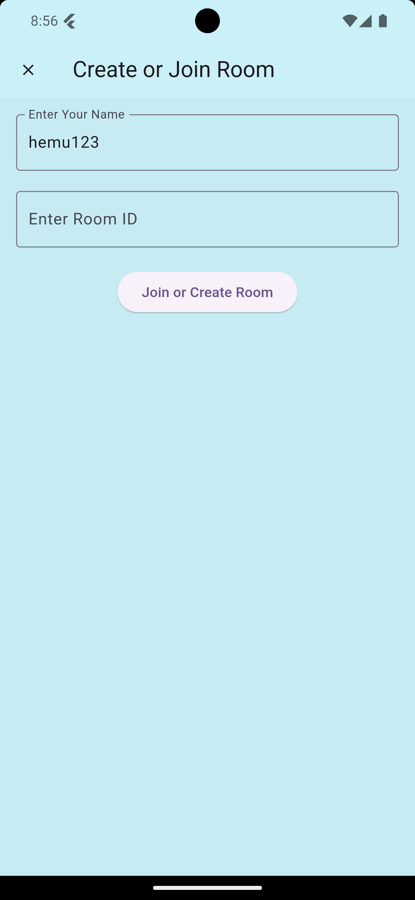

# chatapp_realtime

📱 Real-Time Chat App
A real-time chat application built with Flutter, using a backend powered by Node.js, Socket.IO, and MongoDB. This app supports JWT authentication and includes real-time push notifications for an enhanced user experience.

🚀 Features
Real-Time Messaging: Instant delivery and synchronization of messages across devices.
BLoC Architecture: Clean, maintainable, and testable state management.
JWT Authentication: Secure and reliable user login and session management.
Push Notifications: Get notified instantly when new messages arrive.
Responsive UI: Seamlessly adapts to various screen sizes.
Lightweight Backend: Efficient and fast backend using Socket.IO and MongoDB.
📂 Project Structure
Frontend: Built with Flutter using BLoC architecture for state management.
Backend: Deployed on a dedicated server using Node.js, Socket.IO, and MongoDB.

Authentication: JWT-based secure authentication.
Demo Gif :- 
Screenshots- 

Demo Recording
Watch the full demo here

🔗 Demo:- https://drive.google.com/file/d/1UgsVcA5jxTBhdUHHQxbjirV74enMM8j-/view?usp=sharing
APK Link - https://drive.google.com/file/d/1PMYOnU-uaDRmEA67Pd1u-qSsKRjLMXun/view?usp=sharing

# RealTimeChatApp-BLOC-Architecture-
